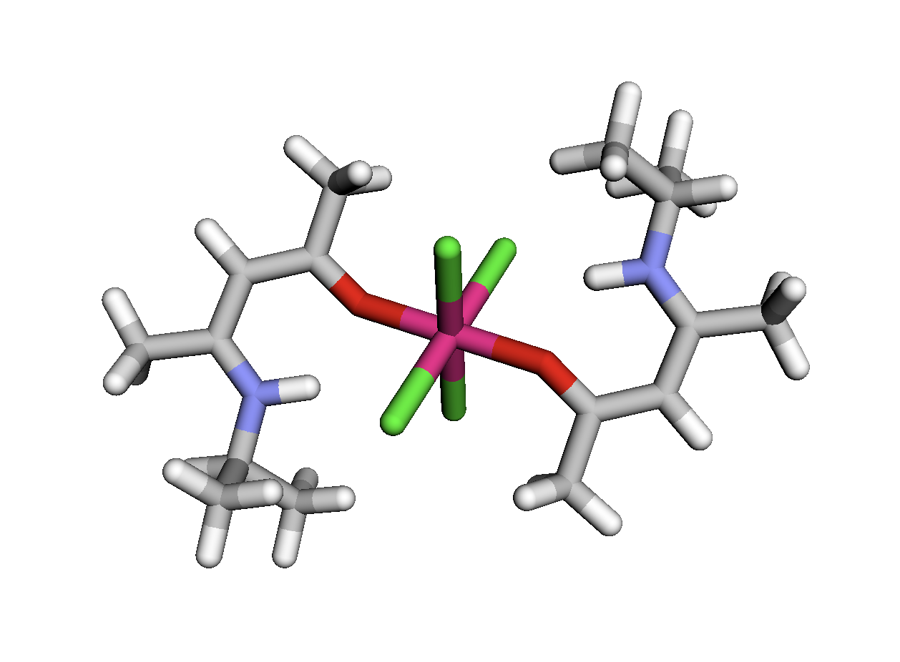

<h1 align="center">
CoordChemPy
</h1>

<br>


CoordChemPy is a powerful tool designed for chemists and researchers working with coordination compounds. This package provides a comprehensive suite of functionalities to visualize, analyze, and characterize coordination compounds using their CSD (Cambridge Structural Database) codes. By leveraging advanced computational methods, CoordChemPy enables users to gain valuable insights into the structural and chemical properties of these compounds.

The primary functionality of CoordChemPy includes the ability to visualize the three-dimensional structure of coordination compounds, calculate distances and angles between atoms, and identify key characteristics such as the central atom and ligands. Additionally, the package can infer bonding patterns and determine the molecular geometry, which are crucial for understanding the compound's reactivity and properties.

CoordChemPy also supports reading and processing .xyz files, which contain atomic coordinates, restricting it's field of activity to a a unic format. The package's robust visualization capabilities make it easy to interpret complex molecular structures, while the detailed analysis features provide essential data for research and development.
It is to be noted that this package works specifically for the TMQM database.  

Whether you are conducting academic research, teaching, or working in the pharmaceutical or materials science industries, CoordChemPy is an invaluable resource for exploring and understanding the fascinating world of coordination chemistry. With CoordChemPy, you can streamline your workflow, enhance your data analysis, and bring clarity to the intricate details of coordination compounds.

## 🔥 Usage

```
from coordchempy import visualize_all_data

# One line to rule them all
result = visualize_all_data(CSD_code)
```
 The function visualize_all_data() returns the 3D modelization of the molecule related to the CSD_code applied , the metal at the its center, the coordination number, the number of ligands contained in the complexe, the angles between bonds of the metal and the the geometry.  


## 👩‍💻 Installation guide
### 1. Prerequisites
Before installing CoordChemPy, ensure that you have the following prerequisites:

Python: CoordChemPy is compatible with Python 3.6 and above.
Pip: Pip is the package installer for Python. It should come pre-installed with most Python distributions.


### 2. Create a Virtual Environment (Optional but Recommended)
Creating a virtual environment is recommended to keep your Python environment clean and isolated. You can skip this step if you prefer to install CoordChemPy globally.

```
# Create a new virtual environment
python3 -m venv coordchempy_env

# Activate the virtual environment
source coordchempy_env/bin/activate
```

### 3.  Install CoordChemPy
Clone the repository to your local machine using git clone:
```
git clone https://github.com/mattatzb/CoordChemPy
````
You can install CoordChemPy from the folder containing the cloned repository in your machine directly using pip:

```
pip install coordchempy
```

### 4. Verify Installation
After installation, you can verify that CoordChemPy is installed correctly by importing it in a Python script or interpreter:

```
import coordchempy
```
If no error is raised, CoordChemPy has been successfully installed.


### 5. Usage
You are now ready to use CoordChemPy in your Python projects! Import the necessary functions and start visualizing and analyzing coordination compounds.

```
from coordchempy import visualize_all_data

## Example usage
visualize_all_data('TEZWUS')
```
This installation guide provides step-by-step instructions for installing CoordChemPy, including optional steps for creating a virtual environment and installing additional dependencies.

## Testing
Make sure that you have pytest installed on your environment and run the test from the folder containing the cloned repository on your terminal:

````
pytest #Run all the test in the test_coordchempy.py file
````

## 🛠️ Development installation

Initialize Git (only for the first time). 

Note: You should have create an empty repository on `https://github.com:username/Name_Of_Package`.

```
git init
git add .
git commit -m "Initial commit" 
git branch -M main
git remote add origin git@github.com:username/name_of_repository.git 
git push -u origin main
```

Then add and commit changes as usual. 

To install the package, run

```
(coordchempy) $ pip install -e ".[test,doc]"
```

### Run tests and coverage

```
(conda_env) $ pip install tox
(conda_env) $ tox
```


